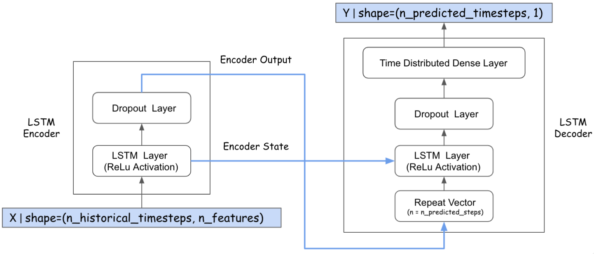

### **XCS-229-II Machine Learning Strategy & Intro to Reinforcement Learning Final Project**

Author: Han Yu

#### Tl;DR

In this project, I have developed several LSTM-based machine learning models (via three different architectures) to
predict the next day’s stock price of Alphabet Inc Class C (NASDAQ: GOOG) via the information derived from the previous
X days. In addition to evaluating the model performance by looking at standard metrics such as Root Mean Square Error (
RMSE), a simple trading strategy has also been implemented to simulate the trading events based on the predicted stock
prices. The final return of investment calculated at the end of simulation is also used as a metric to evaluate and
compare the model performances when deployed in a “real” algorithmic trading system.

#### Summary of Results

This project examines the stock price prediction performance of three popular architectures in sequence modeling, which
includes Long Short-Term Memory (LSTM), Bidirectional LSTM (Bi-LSTM), and Encoder-Decoder. Experiments have been
designed to evaluate the prediction performance among those three architectures when short sequence(7 days’ historical
data), medium sequence (14 days’ historical data), and long sequence(28 days’ historical data) are provided as inputs to
train and predict the next day’s stock price; a simple trading strategy has also been implemented to evaluate the return
of investment using the models trained via those experiments.

Different Model Architectures explored in the project.

See sample stock price prediction below via Bidirectional LSTM (Bi-LSTM) model, where features learned from the past 14
days' are used to predict next day's stock price.

See sample trading event history below via deployed Bidirectional LSTM (Bi-LSTM) model, and the trading strategy is able
to "buy at low" and "sell at high" with good return of investment based on the predicted stock price from the machine
learning model.

#### Final Paper

Final paper can be viewed and be
downloaded [here](https://github.com/bearbearyu1223/Stanford-XCS-229-II/blob/main/XCS229ii-Project/Final%20Paper/XCS229II%20Final%20Paper-Han%20Yu.pdf)
.

#### Contact

Aside from my busy day work and other life commitment, I am a believer of *constant learning*. Learning something new
every day(big or small, does *not* have to be a technical skill), will make a huge difference in the long term.

My LinkedIn profile is shared at [han-yu-go-irish](https://www.linkedin.com/in/han-yu-goirish/).
